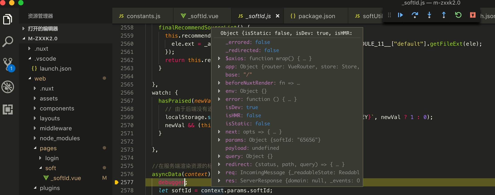

# 调试方法
## 前端代码
前端代码同之前的调试方式，用google浏览器开发者工具即可调试。
## SSR部分
这部分是重点。由于SSR部分代码运行在`node`环境下，对浏览器不透明（实际上也可以通过google浏览器调试，但这里介绍最常用的方法），我们可以利用`vscode`强大的`node`调试功能，来调试这部分代码。
### vscode配置
用`vscode`打开项目之后，点击顶部工具栏中的`调试`-->`打开配置`，将内容替换为以下部分：
```
{
  "version": "0.2.0",
  "configurations": [
    {
      "type": "node",
      "request": "attach",
      "name": "Attach",
      "port": 9229
    }
  ]
}

```
### 代码
在要调试的ssr部分代码中打上断点，例如：
```
asyncData({params}) {
    debugger;
    let softId = params.softId;
}
```
### 启动命令
在项目的`package.json`中配置`debug`启动命令：
`"dev-debug": "node --inspect node_modules/.bin/nuxt"`
然后启动：
`npm run dev-debug`
这时候会通过websocket协议暴漏出9229端口，供vscode监听。

### 执行调试
在`vscode`中按`F5`执行调试，此时会监听到9229端口，然后刷新页面，vscode便会自动进入断点，即可进行单步调试，如图：
