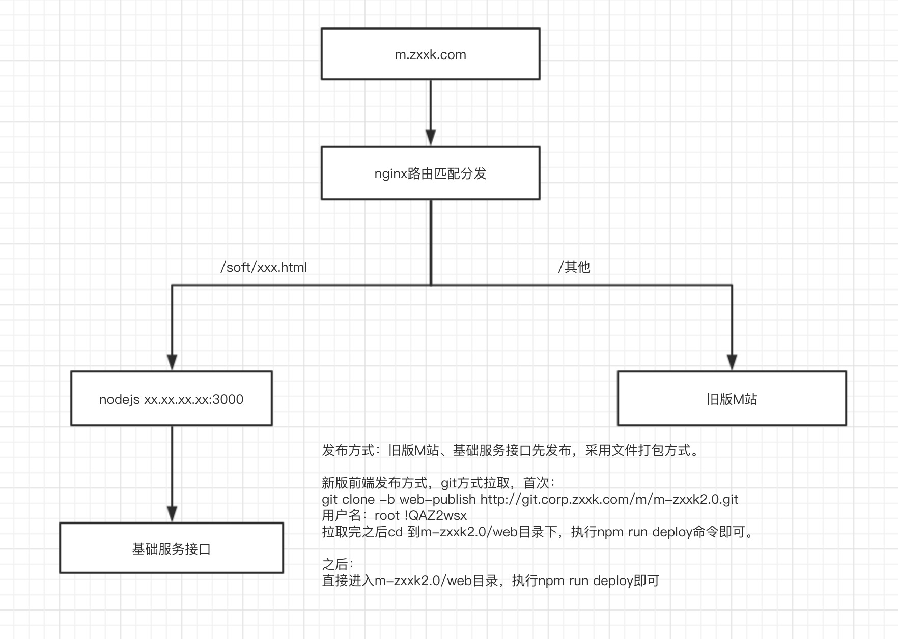

整体技术栈采用vue2.5.17作为数据和视图引擎，nuxt2.3.4（集成了vue2.5.17）作为ssr框架，实现后端渲染，从而对搜索引擎友好。具体技术细节参考nuxt官网：[https://zh.nuxtjs.org/guide。](https://zh.nuxtjs.org/guide。)  
vue部分采用vue-cli3的脚手架进行搭建，具体技术细节可参考vue-cli3官网：[https://cli.vuejs.org/zh/guide/，在此之前需要有vue使用的基础，vue基础部分请参考vue官网：https://cn.vuejs.org/v2/guide/](https://cli.vuejs.org/zh/guide/，在此之前需要有vue使用的基础，vue基础部分请参考vue官网：https://cn.vuejs.org/v2/guide/)  
项目模块化部分采用es6的最新标准，用export和import来定义和导入模块，利用babel进行转义和打包（框架中已集成）。  
采用了es-lint进行代码格式的规范和格式化，编译时不规范的代码将会报错，并可结合开发工具进行按要求的格式化，也可以用命令来自动修复不规范的代码。  
采用npm jsonp模块实现对旧代码的部分jsonp的请求。  
采用nginx反向代理配置实现新旧系统之间的平滑过渡，以及解决cookie传递的共享问题。  
生产环境发布采用pm2来管理和守护线程，在Linux环境下，它也可以用来记录ssr后端渲染时候的日志。  
nuxt和vue的关系如下：  
m-zxxk@1.0.0 /Users/zks/code/gitlab/m-zxxk2.0/web  
└─┬ nuxt@2.3.4  
  └─┬ @nuxt/core@2.3.4  
    └─┬ @nuxt/vue-renderer@2.3.4  
      └── vue@2.5.17

生产环境中新旧系统之间的关系如下：  

